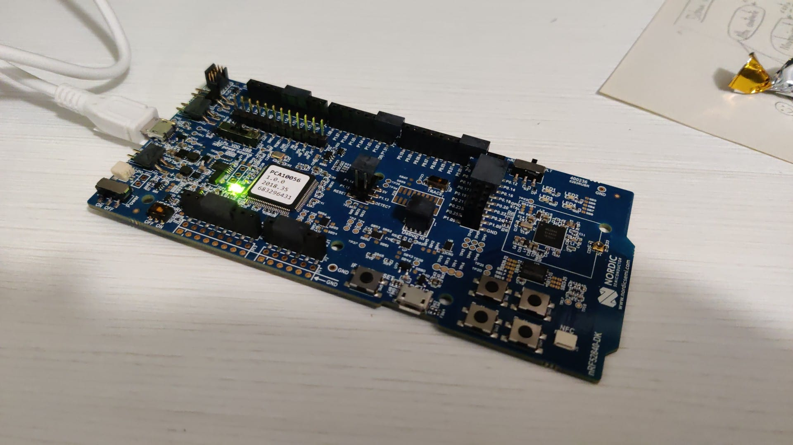
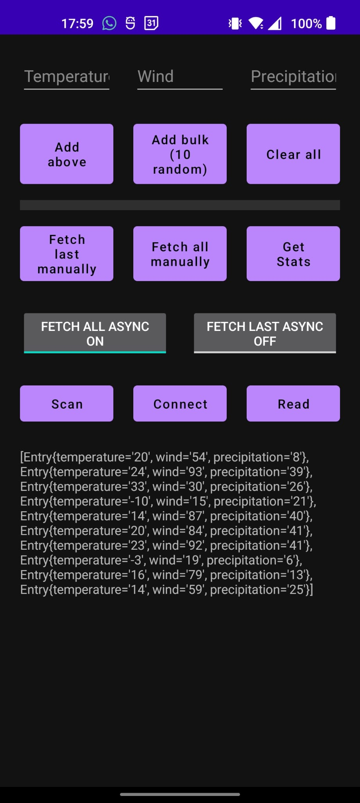
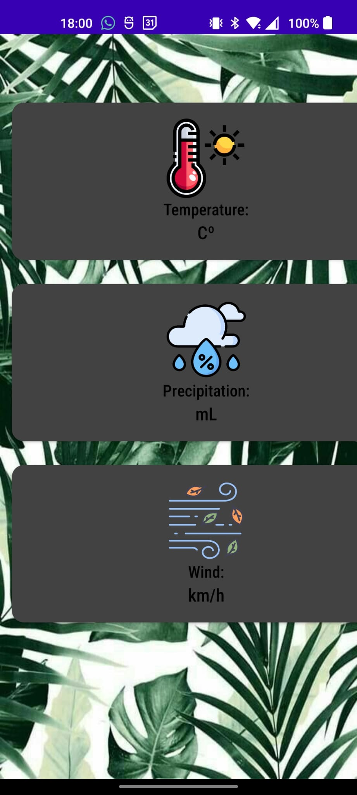
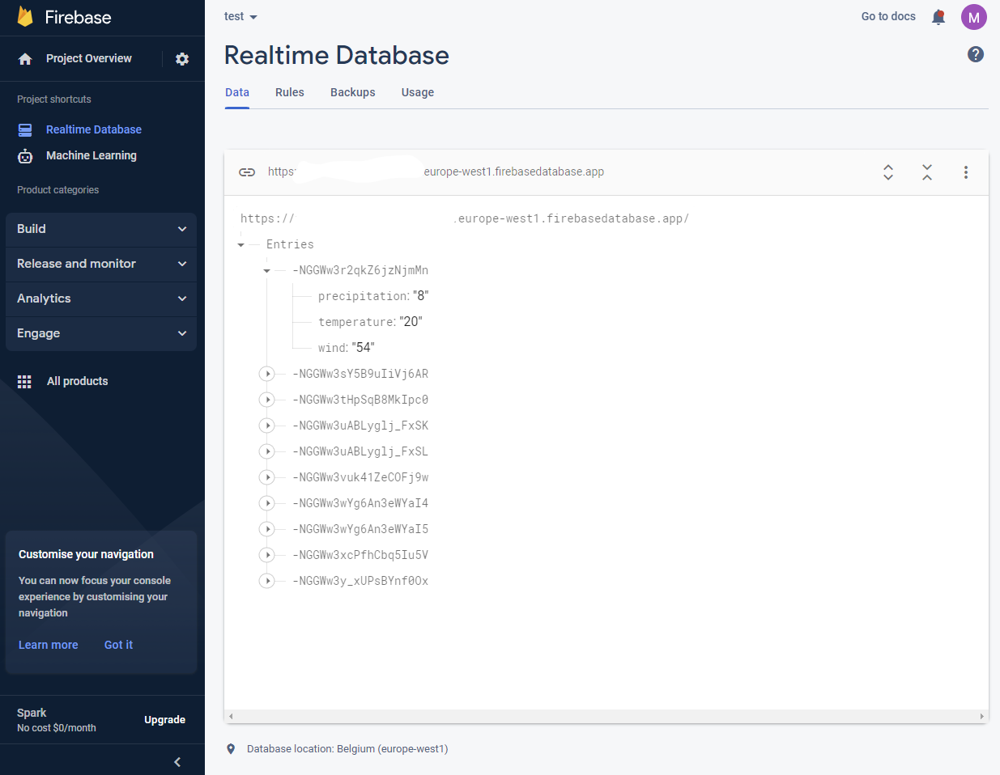

# nrf52840-DK
This project uses a NRF52 development board to read air temperature and humidity. By its Bluetooth Low Energy module, it sends all the data to the android app.

The app, using the Android Bluetooth library, read the data and shows it on the screen. 

Additionally, all the data is later sent to the cloud (Google Firestore).

